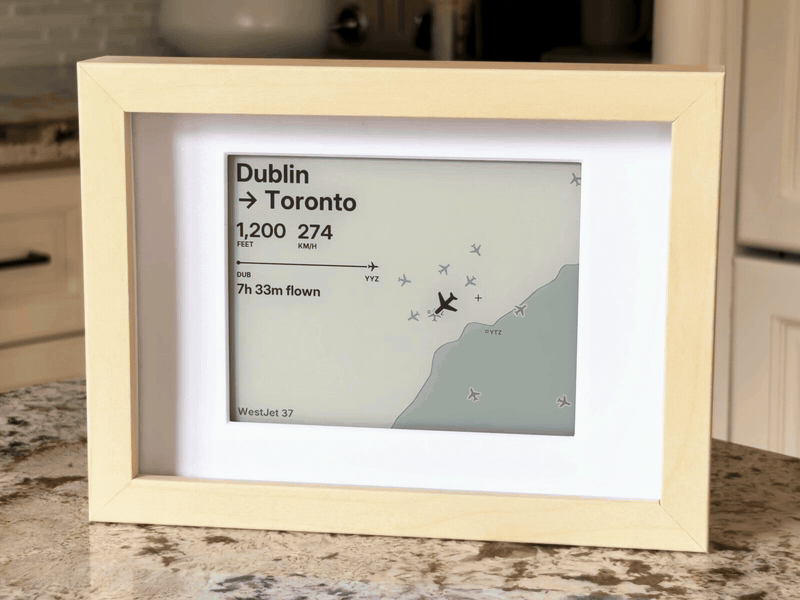

# kindle-planes

A Kindle in a picture frame that shows the planes flying overhead.



A jailbroken Kindle Paperwhite fetches live flight positions, picks the plane closest to
home, and shows where it's flying from and to, how high and fast it's going, and how far
along its trip it is. The screen updates every minute and a charge lasts about five days.
At night it draws the whole day's traffic as one picture.

It can show the sky instead: the ISS, Starlink trains, weather balloons, the Moon,
planets and stars. See [docs/sky.md](docs/sky.md).

Everything runs on the Kindle. Your computer is only needed to install it.

## What you need

- A Kindle Paperwhite 4 (2018) or Paperwhite 2 (2013) that you can jailbreak
- An [IKEA RÖDALM 13×18 cm frame](https://www.ikea.com/ca/en/p/roedalm-frame-birch-effect-30548866/)
  and a 3D-printed [insert](insert/) to hold the Kindle in it
- A [flat ribbon micro-USB extension](https://www.amazon.com/Ribbon-Degree-Angled-Receptacle-Charging/dp/B07Q72VDQF),
  since a normal plug doesn't fit in the frame
- A Mac or Linux computer with [uv](https://docs.astral.sh/uv/)

## Install

1. **Jailbreak the Kindle and set up SSH.** This is the slow part and you only do it once.
   Follow [docs/device-setup.md](docs/device-setup.md) until `ssh kindle` works.
2. **Install.** Press the Kindle's power button once to wake its Wi-Fi, then run:

   ```bash
   git clone https://github.com/azilnik/kindle-planes && cd kindle-planes && tools/install.sh
   ```

   This copies Python and the code to the Kindle and starts the display on every boot.
   Within a minute it shows a plane over Toronto.
3. **Set your home.** Edit `lat`, `lon`, `city` and `airports` in the Kindle's
   `config.json`. See [docs/configuration.md](docs/configuration.md).
4. **Frame it.** Print the insert, put the Kindle in the frame, and measure what the mat
   covers with the test pattern. See [docs/frame.md](docs/frame.md).

## Try it without a Kindle

Render every sample situation into one image:

```bash
uv run --python 3.9 --with pillow==9.0.1 --with requests python planes/samples/sheet.py bold-right out/sheet.png
```


At night it draws every position it saw that day, so the approach paths show up:


## How it works

- Positions come from [adsb.lol](https://adsb.lol), with [adsb.fi](https://adsb.fi) as a
  backup. Routes and aircraft types come from [adsbdb](https://www.adsbdb.com). None of them
  need an API key.
- The Kindle turns on Wi-Fi every 10 minutes to fetch, and every 5 when a plane is close
  or low. In between, it moves each plane along its last known course and redraws once a
  minute.
- Between redraws the Kindle sleeps, which is why a charge lasts days. The numbers are in
  [docs/power.md](docs/power.md).
- If the network is down, the screen says when it last got data, so an outage never looks
  like an empty sky.

## Using Claude Code

The repo is set up for [Claude Code](https://claude.com/claude-code): [AGENTS.md](AGENTS.md)
has what an agent needs to know. With your Kindle on `ssh kindle`, you can ask things like
*"set home to my address and show me a screenshot"* or *"use the detailed style"*.

## Contributing

Run `ruff check planes tools insert` and render the samples before opening a pull request.
Use `tools/fbshot.sh` for screenshots of the Kindle.

## License

MIT. The fonts and map data keep their own licenses; see [LICENSE](LICENSE).
