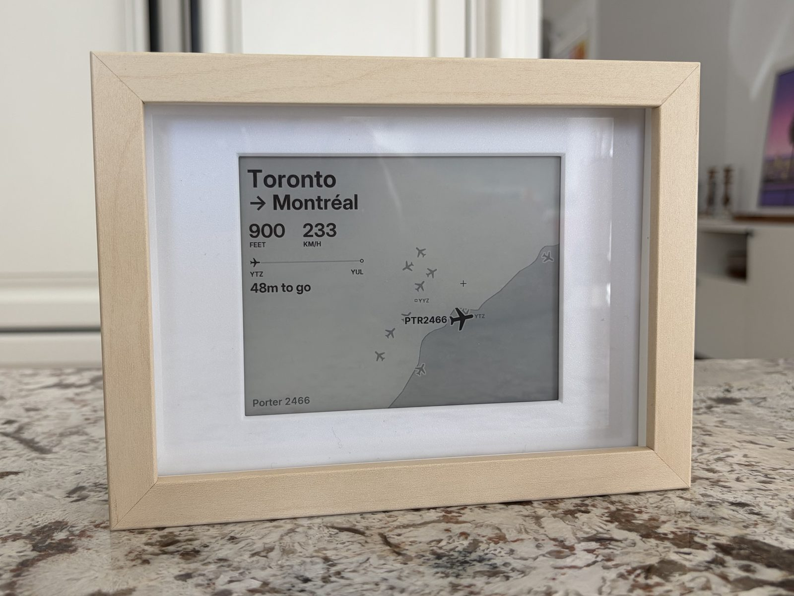
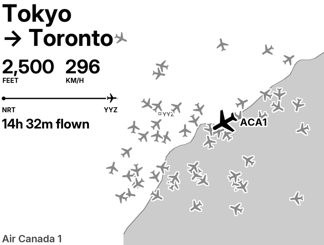
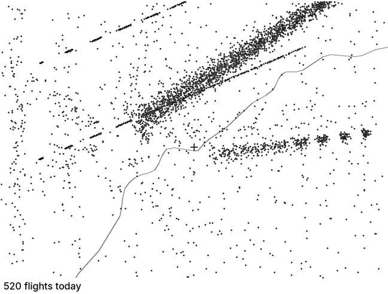
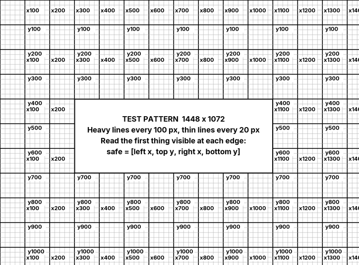
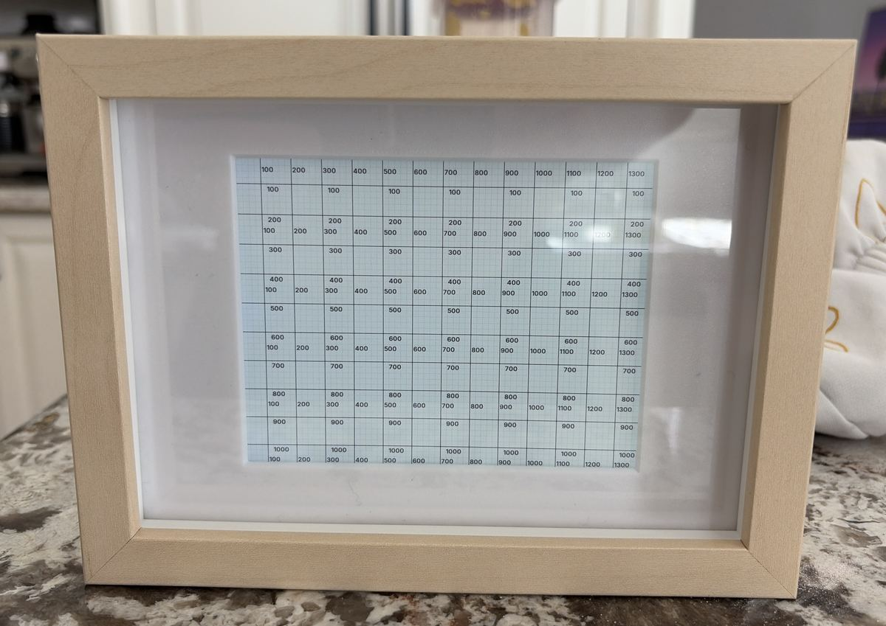
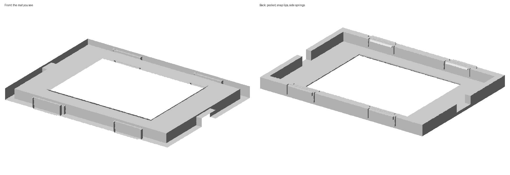
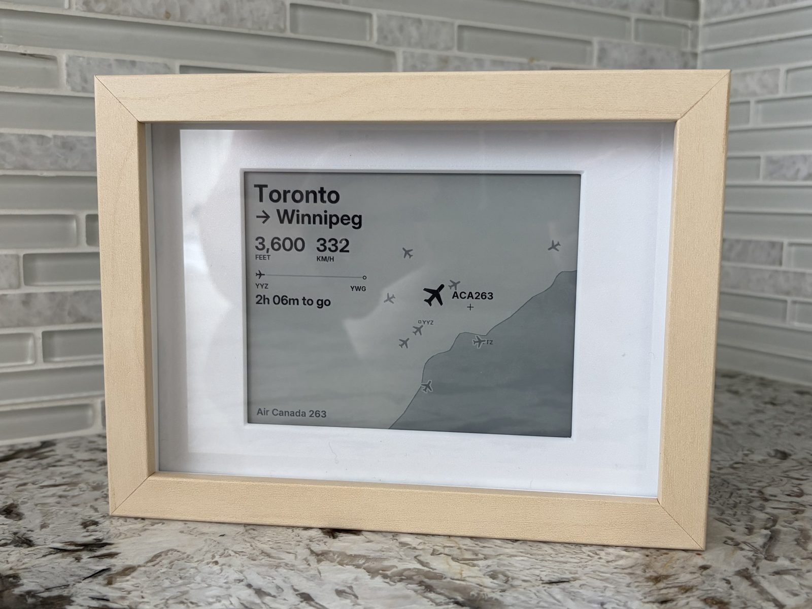

# kindle-planes

**A Kindle in a picture frame that shows the planes overhead.**



An old Kindle Paperwhite (2018, or with its own Python build a 2013 one) runs this on its own. It fetches live flight positions, picks the
closest plane, and draws where it's going, how high and fast it is, and how far along its
trip it is. The screen updates every minute. A charge lasts about five days. At night it
draws the whole day's traffic as one picture.

Agents: read [AGENTS.md](AGENTS.md) first.

---

## Start here

**Is this for you?** The code is the easy part. Getting a Kindle ready is not: you jailbreak
it and put SSH on it. If you have used a terminal before, plan an evening, and let Claude
Code drive. If you haven't, do step 1 below and decide after that.

### What you need

| | |
|---|---|
| Kindle | Paperwhite 10th generation (2018, "PW4"), on firmware that can still be jailbroken. A Paperwhite 2 (2013) works too, with its own Python build: see [device setup](docs/device-setup.md#paperwhite-2) |
| Frame | [IKEA RÖDALM 13×18 cm](https://www.ikea.com/ca/en/p/roedalm-frame-birch-effect-30548866/) (article 305.488.66), or the [21×30 cm](https://www.ikea.com/gb/en/p/roedalm-frame-birch-effect-20548881/) (205.488.81) |
| Insert | Printed from [insert/](insert/). About 54 cm³ of PETG; fits a 180 mm bed |
| Cable | For the 13×18: a flat ribbon micro-USB extension with an angled plug, [like this one](https://www.amazon.com/Ribbon-Degree-Angled-Receptacle-Charging/dp/B07Q72VDQF). A normal plug doesn't fit beside the Kindle. The 21×30 takes any right-angle plug |
| Computer | macOS or Linux with [uv](https://docs.astral.sh/uv/), and ideally [Claude Code](https://claude.com/claude-code) |

### 1. See it on your computer

No Kindle needed. Open Claude on an empty folder and paste:

```text
Clone azilnik/kindle-planes, read its AGENTS.md, then render every style from the samples
and show me.
```

Or by hand:

```bash
uv run --python 3.9 --with pillow==9.0.1 --with requests python planes/samples/sheet.py bold-right out/sheet.png
```

**You'll know it worked when** you see a contact sheet like this, one per style:



### 2. Get the Kindle ready

[docs/device-setup.md](docs/device-setup.md): jailbreak it and put SSH on it. This is the
slow step, it can't be scripted, and you do it once.

**You'll know it worked when** `ssh kindle` gives you a prompt.

### 3. Install

Press the Kindle's power button once, then:

```bash
git clone https://github.com/azilnik/kindle-planes && cd kindle-planes && tools/install.sh
```

That puts Python on the Kindle, copies the code, and starts the display on every boot.

**You'll know it worked when** the Kindle shows a plane over Toronto within a minute.

Then make it yours. With Claude:

```text
My Kindle answers to `ssh kindle`. Set home to <your address> and show me a screenshot.
```

Claude writes the location into the Kindle's `config.json`, builds a shoreline for your
lake, and reads the screen back. Then say what's wrong with it: *"turn the map so north is
up"*, *"use the detailed style"*. By hand, it's [Make it yours](#make-it-yours). Every
setting is one line, and the Kindle re-reads it every minute.

### 4. Frame it

Print the insert, press the Kindle into it, and put it in the frame: [The frame](#the-frame).
Then tell the display which part of the screen the frame leaves visible:
[The test pattern](#the-test-pattern).

---

## What it shows

**Day.** The nearest plane in the air. City pair, height and speed, a progress line between
the two airports, time flown or time to go, airline and flight number. The map shows home
as a crosshair, the airports, the lake, and every other plane within 30 km.

**Night** (11 pm to 7 am). One drawing of the day: every position it saw, as a dot. Approach
paths draw themselves.



**Quiet skies** when nothing is up. **Offline** with the time of the last fetch if the
network is down, so an outage never looks like an empty sky.

---

## Make it yours

Everything is in `planes/config.json` on the Kindle. Edit it over SSH; no restart needed.

| Key | What it does | Default |
|---|---|---|
| `style` | `bold-right` (photos above), `bold` (mirrored), `bold-traffic` (adds the day's chart), `detailed` (dense, many labels) | `bold-right` |
| `lat`, `lon` | Home. The map is centered here | Toronto City Hall |
| `city`, `airports` | Your city's name and its airports, `[["YYZ", lat, lon], ...]` | Toronto, YYZ + YTZ |
| `heading` | Compass direction you face when looking at it; the map turns so that's up | `0` (north up) |
| `rotate` | `270` puts the Kindle's logo on the left, `90` on the right | `270` |
| `safe` | The part of the screen your frame doesn't cover, `[x0, y0, x1, y1]`. The map runs to it | fits the frame below |
| `inset` | How far text keeps inside `safe`, in px. 12 is 1 mm | `12` (`0` on the PW4 in the photos, whose `safe` has the margin built in) |
| `night` | `["23:00", "07:00"]` | |
| `tz` | Your time zone, in POSIX form: `"PST8PDT,M3.2.0,M11.1.0"` | Toronto |
| `frontlight` | 0–24, only while on a charger | `3` |
| `power` | `wifi_toggle`, `suspend`, `governor`. All on for battery life | on |

**A new place.** Set `lat`, `lon`, `city`, `airports`. The lake comes from
`tools/shore.py "Lake Ontario" LAT LON`, which pulls the shoreline from Natural Earth. No
lake? Make `planes/shore.json` an empty list: `[]`.

**The power button.** One press wakes the Kindle with Wi-Fi on for 10 minutes, so you can
SSH in. A second press a few seconds later hands the screen back to the normal Kindle. A
reboot brings the planes back.

---

## The test pattern

A frame hides the edges of the screen. `safe` in `config.json` is the box that's left, as
`[left, top, right, bottom]` in pixels, and everything is laid out inside it.



1. Press the Kindle's power button once. That wakes it with Wi-Fi on for 10 minutes.
2. `tools/grid.sh` puts the pattern on the screen.
3. With the Kindle in the frame, read the first thing you can see at each edge. Heavy lines
   are every 100 px and labeled, thin lines every 20. If the left edge shows two thin lines
   and then `x100`, left is 60. Round inward.
4. Put the four numbers in `safe` on the Kindle. The map runs right to those edges; text
   keeps 1 mm further in by itself (`inset`, 12 px).
5. `tools/grid.sh check` draws that box. All four sides of the border should be visible,
   right at the mat. `tools/grid.sh done` brings the planes back.

With Claude: take a photo straight on and say *"here's the test pattern through my frame,
set safe"*.



---

## The frame

IKEA RÖDALM 13×18 cm, with a printed insert that holds the Kindle behind a mat and leaves
room for a flat USB cable.



| Frame | Print this | Notes |
|---|---|---|
| RÖDALM 13×18 cm | [insert-rodalm13x18.3mf](insert/insert-rodalm13x18.3mf) or [.stl](insert/insert-rodalm13x18.stl) | The printed face is the mat. Needs the flat cable. This is the one in the photos |
| RÖDALM 13×18 cm, Paperwhite 2 | [insert-rodalm13x18-pw2.3mf](insert/insert-rodalm13x18-pw2.3mf) or [.stl](insert/insert-rodalm13x18-pw2.stl) | The same insert with 0.5 mm more on the port edge and a 40 mm cable slot centered on it. Not printed yet: the change comes from a test fit in the PW4 insert |
| RÖDALM 21×30 cm | [insert-rodalm21x30.3mf](insert/insert-rodalm21x30.3mf) or [.stl](insert/insert-rodalm21x30.stl) | Sits behind IKEA's paper mat. Not yet built; measure the mat opening first |

Print face-down in PETG, no brim or skirt. PLA works until the spring tabs relax. Both fit
a 180 mm bed.

**Another frame.** Anything with an opening of at least 180 × 131 mm and 12 mm of depth
behind the glass can work. Add its size to `FRAMES` in [insert/insert.py](insert/insert.py)
and run it; the command is at the top of that file. It prints a `safe` to start from.
Then measure with the test pattern, because the measurement is what counts.



---

## What's on the Kindle

| Where | What |
|---|---|
| `/mnt/us/planes/` | The code, fonts and shoreline from [planes/](planes/). `tools/deploy.sh` copies it |
| `/mnt/us/planes/config.json` | Your settings. Never overwritten by a deploy |
| `/mnt/us/planes/cache.json` | Routes and aircraft types already looked up |
| `/mnt/us/planes/tracks.json`, `traffic.json` | Today's positions for the night view, and plane counts for the chart |
| `/mnt/us/planes/power.log` | Battery readings |
| `/mnt/us/python/` | Python 3.12 with Pillow and requests |
| `/etc/upstart/planes.conf` | Starts the display on boot |
| `/tmp/planes.log` | Errors. Gone after a reboot |

Nothing is sent anywhere except the requests for plane positions around `lat`, `lon`.
To remove it all, delete those two folders and `planes.conf`.

---

## How it works

Positions come from [adsb.lol](https://adsb.lol) (with [adsb.fi](https://adsb.fi) as
backup), routes and aircraft types from [adsbdb](https://www.adsbdb.com). No keys.

The Kindle only turns Wi-Fi on for a few seconds every 10 minutes to fetch. Between fetches
it moves each plane along its last known track and speed, redraws once a minute, and
deep-sleeps in between. Wi-Fi joins are the big cost; everything else was tuned until a
frame draws in about a third of a second. [docs/power.md](docs/power.md) has the numbers.

Two Kindles in one home share a public IP, and with it adsb.lol's rate limit. Each asks every
5 to 15 minutes and backs off after a failure, which leaves plenty of room; a laptop fetching
live data on the same network does not, so previews render from saved samples.

Routes are checked before they're shown: a plane low over Toronto is on the leg that starts
or ends here, and a route whose path doesn't pass near the plane is dropped. Time flown and
time to go are estimates from position and speed; there is no schedule data.

---

## Repo map

| Path | What it is |
|---|---|
| [AGENTS.md](AGENTS.md) | What an agent needs to know that the code doesn't say |
| [planes/](planes/) | Everything that runs on the Kindle: `planes.py` (fetch, draw, loop), `power.py` (Wi-Fi, sleep, battery log), `run.sh`, `config.json`, fonts, shoreline |
| [planes/samples/](planes/samples/) | Saved and synthetic data for previews. `sheet.py` renders them all |
| [tools/](tools/) | `install.sh`, `deploy.sh`, `fbshot.sh` (screenshot), `grid.sh` (test pattern), `shore.py` (new lake), `battery.py` (power log) |
| [insert/](insert/) | The frame insert: ready-to-print `.3mf` and `.stl`, and `insert.py`, which generates them |
| [build/](build/) | The SSH installer, and how the Python bundle in the release is built |
| [docs/device-setup.md](docs/device-setup.md) | Jailbreak, SSH, Python, install |
| [docs/power.md](docs/power.md) | Battery measurements and what each change was worth |
| [docs/roadmap.md](docs/roadmap.md) | Phone setup mode, so someone else can own one |

## Contributing

Run `ruff check planes tools insert` and render the contact sheets before opening a PR.
Screenshots come from `tools/fbshot.sh`, not the camera. If you correct Claude on the same
thing twice, that correction belongs in `AGENTS.md`.

MIT. Fonts and data keep their own licenses; see [LICENSE](LICENSE).
