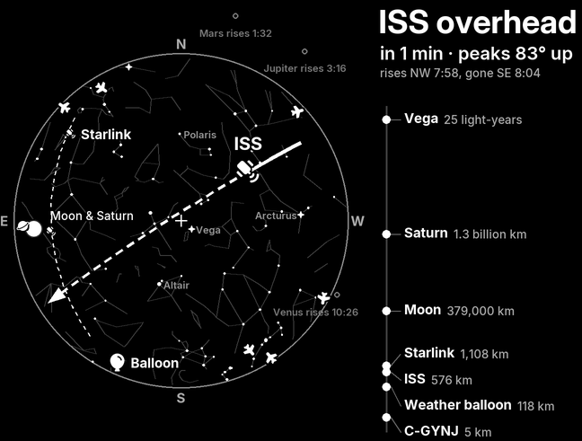

# The sky frame

The sky frame shows everything above your home, as if you were lying on the lawn looking
up. The middle of the circle is straight overhead, north is up and east is on the left.



## What it shows

- The planes overhead
- The ISS and China's Tiangong station, with the path of the next pass you can see
- The newest Starlink launch, while its satellites still cross the sky in a line
- The nearest weather balloon, and a side view of its climb that shows where the wind turns
- The Sun, the Moon in its current phase, and Venus, Mars, Jupiter and Saturn
- After dark, the brighter stars and the constellations

The headline picks the one thing worth going outside for, such as *ISS at 8:01* or
*Starlink train*. The line on the right shows how far away each thing is, from the nearest
plane to a star.

Things just below the horizon are drawn in grey outside the circle, with the time they
rise.

## Turn it on

```bash
ssh kindle sh /mnt/us/planes/run.sh frame sky
```

`run.sh frame planes` switches back. Both write `"frame"` in `config.json` and restart the
display.

## Where the data comes from

- Planes: the same adsb.lol fetch as the planes frame.
- Satellite orbits: [CelesTrak](https://celestrak.org), at most once every 20 hours. The
  Kindle keeps them in `orbits.csv`, so a day without network still shows them.
- Weather balloons: [SondeHub](https://sondehub.org), only in the hours after the launches
  at 00:00 and 12:00 UTC.
- The Sun, Moon, planets and stars are worked out on the Kindle, with no network.
  Satellite positions use [sgp4](https://pypi.org/project/sgp4/), and the star catalog
  comes from [d3-celestial](https://github.com/ofrohn/d3-celestial).

## At night

During the `night` hours the Kindle doesn't fetch, and redraws the sky every half hour.
The stars keep turning, and planes drop off the screen once their data is too old.

## Preview it

```bash
uv run --python 3.9 --with pillow==9.0.1 --with requests python planes/samples/sheet.py sky out/sky.png
```
